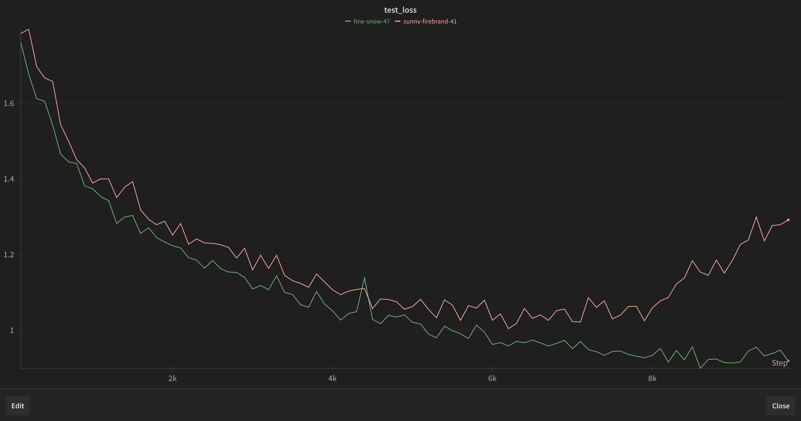
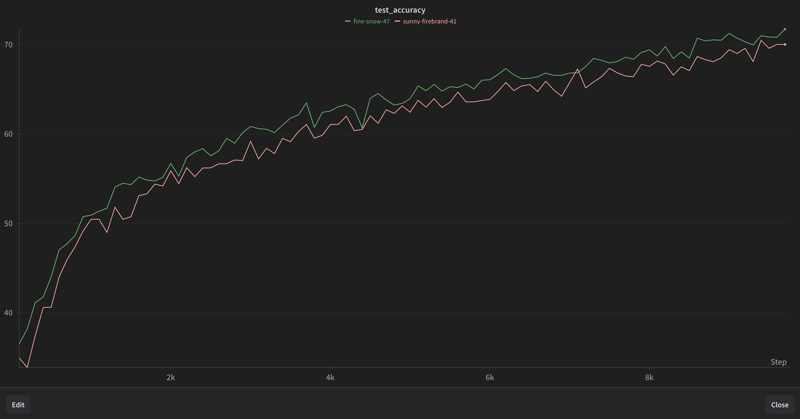

# flat-sophia

Sophia optimizer further projected towards flat areas of loss landscape

Ideas come mainly from [this paper by Wang et al.](https://arxiv.org/abs/2405.20763)

They projected adam towards a flatter area using Hvp. Here, since sophia is already 
using the Hvp, we keep a cheap int8 mask used to further project sophia's update towards
flatter areas.

## A small experiment

run_experiment.py is a sort of worst case scenerio experiment where a ViT is too 
wide and shallow and is prone to overfitting.

Baseline is orange line, flat-sophia is green line. Projecting updates towards flatter 
areas helped prevent overfitting and the rise in loss.

## How it works

There are two pertinent values, `sharp_fraction` and `dampening_factor`. `sharp_fraction` 
is the fraction of sharpest updates that will be dampened, and `dampening_factor` is the 
factor by which they'll be scaled down. The example uses `sharp_fraction=0.2` and 
`dampening_factor=10`.

Whenever the preconditioner is updated, we also update the sharpness mask with the largest 
`sharp_fraction` of Hvp values equal to `dampening_factor`, and the rest equal to 1. 
The final update is then divided by this mask.